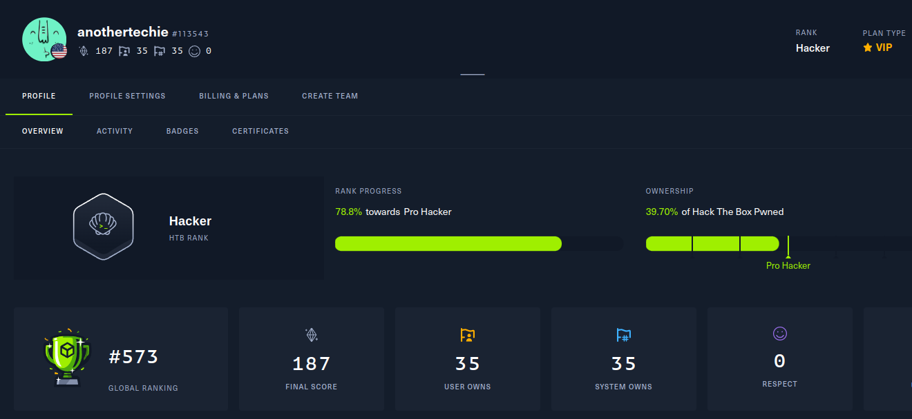

# Professional Summary
I am a passionate and driven penetration tester with 3+ years of experience in Cybersecurity and success with working remotely. I have experience working with high level stakeholders to meet the cybersecurity objectives of clients. My peers would describe me as having a passion for learning, and excited to tackle new challenges in this dynamic field. My best qualities are my strong work ethic, compassion, and perseverance. My technical skills include penetration testing, network administration, and risk management. 

I am one of the top 600 hackers globally out of [over 2 million](https://www.hackthebox.com/blog/htb-two-million-platform-members) other hackers on Hack the Box (HTB). Furthermore, I am in the top 1% of students on Hack the Box Academy. I am self taught and I completed my CEH, OSCP, and OSWP without any prior professional experience in penetration testing.

Additionally, I have a strong academic background in Cybersecurity. I completed my Bachelors of Science and Masters of Science, both in Cybersecurity and Information Assurance, at Western Governors University (WGU) in 1 1/2 years. For my Bachelors degree I completed 32 classes in 1 year. For my Masters degree I completed 10 course in 6 months. I graduated with my Masters Degree in Cybersecurity and Information Assurance 1 month after my 22nd birthday.

Copies of my diplomas and certifications are available upon request or on [LinkedIn](https://www.linkedin.com/in/paul-d/).

# Hack the Box (HTB) Progress
08/16/23: #695 -> #596 globally 

08/24/23: #596 -> #573 globally

## HTB Academy
I'm rated in the **top 1%** of students on HTB academy. My course transcripts are available as a PDF in this repo.
