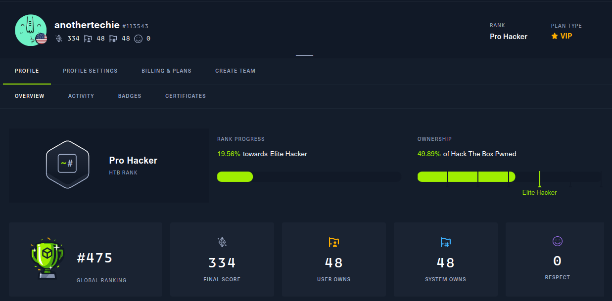

# Professional Summary
My specialty is penetration testing and I have 3+ years of experience in Cybersecurity. I've demonstrated success with working remotely. With previous positions, I gained experience working with high level stakeholders and protected upwards of $100M in revenue. My peers would describe me as having a passion for learning, and excited to tackle new challenges in this dynamic field. My best qualities are my strong work ethic, compassion, and perseverance. My technical skills include penetration testing, network administration, and risk management. 

On Hack the Box, I reached 475th place globally out of [over 2 million hackers](https://www.hackthebox.com/blog/htb-two-million-platform-members). On Hack the Box Academy I’m in the top 1% of students. I am self taught and I completed my CEH, OSCP, and OSWP without any prior professional experience in penetration testing.

Additionally, I have a strong academic background in Cybersecurity. I completed my Bachelors of Science and Masters of Science, both in Cybersecurity and Information Assurance, at Western Governors University (WGU) in 1 1/2 years. For my Bachelors degree I completed 32 classes in 1 year. For my Masters degree I completed 10 course in 6 months. I graduated with my Masters Degree in Cybersecurity and Information Assurance 1 month after my 22nd birthday.

Copies of my diplomas and certifications are available upon request or on [LinkedIn](https://www.linkedin.com/in/paul-d/).

# Hack the Box (HTB) Progress
08/16/23: #695 -> #596 (**TOP 600 Globally**)

08/24/23: #596 -> #573

09/12/23: #573 -> #541

09/18/23: #541 -> #497 (**TOP 500 Globally**)

09/21/23: #497 -> #475

## HTB Academy
I'm rated in the **top 1%** of students on HTB academy. My course transcripts are available as a PDF in this repo.
